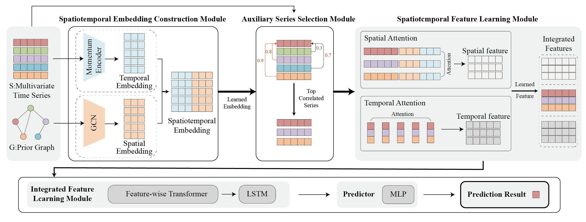
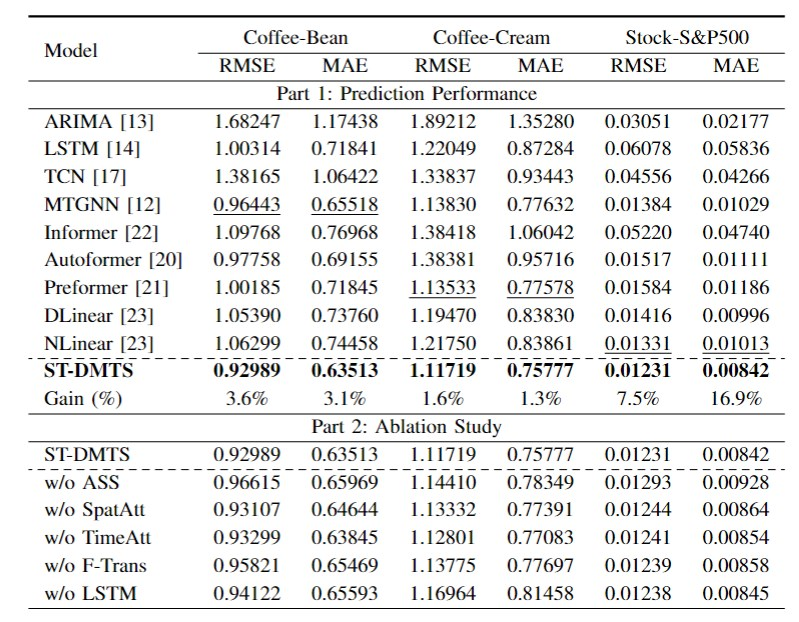

# ST-DMTS

ST-DMTS, designed to explicitly learn spatiotemporal information to accurately predict target series and flexibly adapt to dynamic multivariate time series scenarios.

## Highlights
* We introduce the ST-DMTS model for MTS prediction, which constructs spatiotemporal embeddings for each time series and explicitly incorporates spatiotemporal learning to enhance prediction accuracy.
* The ST-DMTS selects the most relevant series as the auxiliary series using the Auxiliary Series Selection Module, which is based on the learned spatiotemporal embeddings. This process enables the model to incorporate spatial information among series, allowing it to flexibly adapt to DMTS scenarios without retraining.
* We validate our method on three real-world application datasets. The experimental results demonstrate that ST-DMTS achieves the best performance in MTS forecasting. Additionally, ST-DMTS has been successfully applied to the SF Express international supply chain system, which serves the leading coffeehouse chain.

## Predictive Performance

